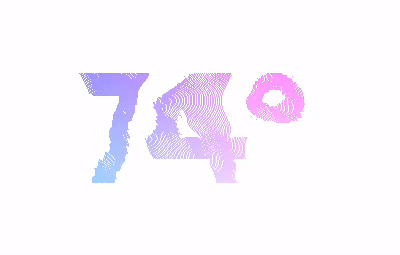

# Processing Portfolio
Hey! My name is Mason Slover and I'm a mathematics and computer science student at Fordham University at Lincoln Center. I have been creating art using Processing, a visual Java environment, for 5 years. This GitHub repository contains some of my favorite works and the '.pde' files:

## Facial Obfuscation Mirrors

Inspired by the peaceful protests in Hong Kong and the United States and the growing fear of government authorities using facial recognition to identify and prosecute protestors, I created several facial obfuscation mirrors that prevent recognition of the observer by humans and facial detection software.

### [Facial Tracking and Dithering](./Dithering)

This project selects random pixels from the input of the and creates a rectangle using the color of the pixel selected. Using [OpenCV for Processing,](https://github.com/atduskgreg/opencv-processing) all faces within view of the webcam are detected, and the size of the rectangle drawn within the frame of the face are increased to obfuscate the viewer and prevent identification. Upon clicking on the window with the mouse, the sizes of the rectangles are reversed, revealing the viewer and obstructing the background.

### [Image Rasterization and "Ghosting"](./Ghosting)

This program hooks into a user's webcam and augments its input. Using the global `resolution` variable, the video feed is evaluated at several intervals where the brightness of selected pixels are mapped to the size of an ellipse at the same point. The color is also taken from this point. By progressively destroying older frame's content, the viewer is only recognizable when they are still.

## [Warping Type using Perlin Noise](./PerlinOffset)

Using [Perlin noise,](https://en.wikipedia.org/wiki/Perlin_noise) this project warps type by offsetting individual pixels based on the value of the noise generated at a point. The noise is translated under the type, resulting in a rippling effect.

## [Dynamic Variable Width Fonts](./VariableWidthFonts)

Using processing, I was able to import a variable width font and dynamically adjust the type's weight and height. Using sinusoidal speed changes and random character attributes, this project creates dynamic type that allows for extreme flexibility.

## [Flocking Algorithm](./FlockingAlgorithm)

Using a [Craig Reynold's Boids algorithm writeup](http://www.red3d.com/cwr/boids/), I implemented three flocking behaviors to simulate natural behavior in Processing:

<h5>Separation:</h5> 

Any "Boid" within 20 pixels with another Boid will steer away from the center of the other Boid to avoid colliding.

<h5>Cohesion:</h5>

Each Boid calculates the average steering position of all other Boids within 20px, and steers towards the average vector. This allows for "flocks" of Boids.

<h5>Alignment:</h5>

Each Boid will steer towards the average heading of all other Boids within 20px. This allows for flocks to fly in the same direction.

When the mouse is pressed, the location of the pointer acts as a point of avoidance for all Boids within the shown radius. If a Boid enters this radius, it will be steered away from the mouse. The mouse may also act as a point of attraction, steering all Boids to its center.

