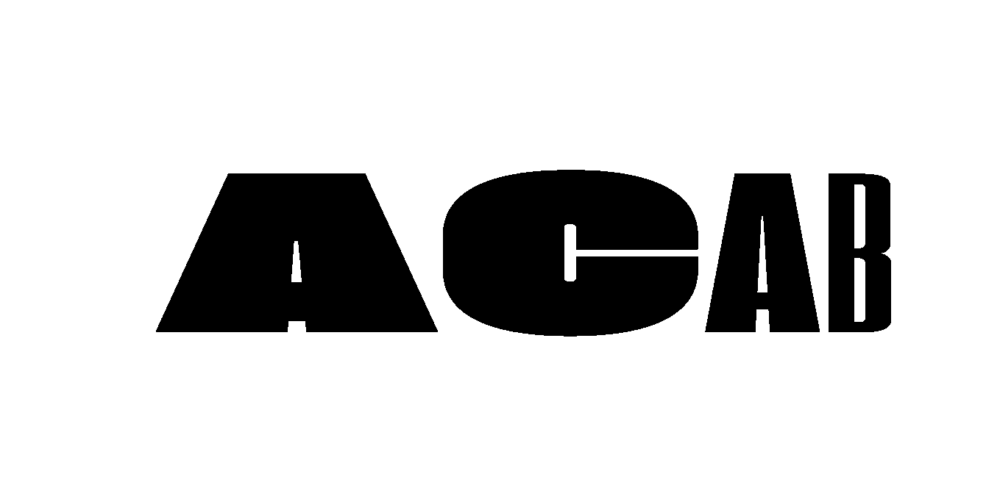

# Processing Portfolio
Hey! My name is Mason Slover and I am a mathematics and computer science student at Fordham University Lincoln Center. I have been creating art using Processing, a visual Java environment, for 5 years. This GitHub is a repository of some of my favorite works, some of which are open source. Here are a couple of my favorite pieces:

## [Dynamic Variable Width Fonts](./VariableWidthFonts)
Using processing, I was able to import a variable width font and dynamically adjust the type's weight and height. Using sinusoidal speed changes and random character attributes, this project creates dynamic type that allows for extreme flexibility.

## [Flocking Algorithms](./FlockingAlgorithm)

Using a [Craig Reynold's Boids algorithm writup](http://www.red3d.com/cwr/boids/), I implemented three main flocking behaviors to simulate natural behavior in Processing:

### Separation: 

Any "Boid" within 20 pixels with another Boid will steer away from the center of the other Boid to avoid colliding.

### Cohesion: 

Each Boid calculates the average position of all other Boids within 20px, and steers towards that point. This allows for "flocks" of Boids.

### Alignment: 

Each Boid will steer towards the average heading of all other Boids within 20px. This allows for flocks to fly in the same direction.

## Facial Obfuscation Mirrors

Inspired by the peaceful protests in Hong Kong and the United States and the growing fear of government athorities using facial recognition to identify and prosecute protestors, I created several facial obfusication algorithms that prevent recognition of the observer.

### [Image Rasterization and "Ghosting"](./Ghosting)

This program hooks into a user's webcam and augments it's input. Using the global `resolution` variable, the video feed is evaluated at several intervals where the brightness of selected pixels are mapped to the size of an ellipse at the same point. The color is also taken from this point. By progressivly destroying older frame's content, the viewer is only recognizable when they are still.

